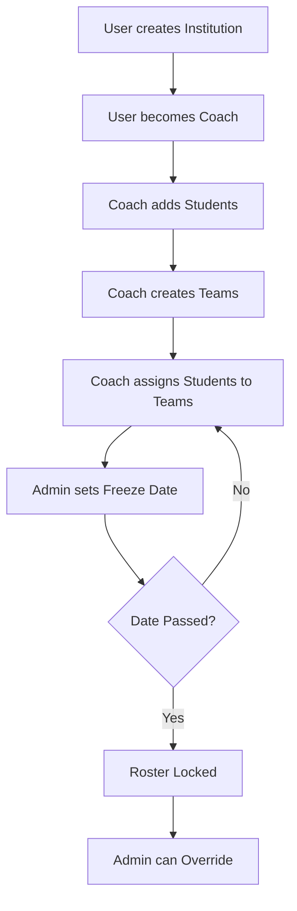

# Tournament System Quick Start Guide

## 🚀 Getting Started

This guide will help you quickly understand and start using the tournament system.

## Prerequisites

- Node.js installed
- PostgreSQL database running
- Clerk authentication configured
- Environment variables set in `.env`

## Database Setup

The migration has already been applied. If you need to reset:

```bash
npx prisma migrate reset
npx prisma migrate dev
```

## Core Concepts in 60 Seconds

1. **Institutions** = Schools/Organizations
2. **Coaches** = Manage their institution's teams
3. **Teams** = 3-5 debaters per team
4. **Roles** = DEBATER or JUDGE
5. **Freeze** = Lock roster changes at a specific date

## Quick API Reference

### Create an Institution
```http
POST /api/institutions
{ "name": "Harvard University" }
```
→ You become a coach automatically

### Add Students
```http
POST /api/institutions/{id}/members
{ "userId": "user_123", "isCoach": false }
```

### Create a Team
```http
POST /api/tournaments/{id}/teams
{ "institutionId": "inst_123" }
```
→ Creates "Harvard University 1"

### Add Debaters
```http
POST /api/tournament-teams/{id}/members
{ "userId": "user_123", "role": "DEBATER" }
```
→ Add 3-5 debaters per team

### Freeze Roster
```http
POST /api/tournaments/{id}/freeze
{ "rosterFreezeAt": "2025-12-01T00:00:00Z" }
```
→ Locks all changes after this date

## Key Validations

| Rule | Validation | Error |
|------|------------|-------|
| One institution per user | ✓ | 409 Conflict |
| 3-5 debaters per team | ✓ | 400 Bad Request |
| Single appearance in tournament | ✓ | 409 Conflict |
| Only coaches can manage | ✓ | 403 Forbidden |
| No changes after freeze | ✓ | 423 Locked |

## Typical Workflow



## Testing the System

### 1. Create Your Institution
```bash
curl -X POST http://localhost:3000/api/institutions \
  -H "Content-Type: application/json" \
  -d '{"name":"Test University","description":"Test"}'
```

### 2. Add a Member
```bash
curl -X POST http://localhost:3000/api/institutions/{id}/members \
  -H "Content-Type: application/json" \
  -d '{"userId":"user_123","isCoach":false}'
```

### 3. Create a Team in Tournament
```bash
curl -X POST http://localhost:3000/api/tournaments/{tournamentId}/teams \
  -H "Content-Type: application/json" \
  -d '{"institutionId":"inst_123"}'
```

### 4. Add Debaters
```bash
curl -X POST http://localhost:3000/api/tournament-teams/{teamId}/members \
  -H "Content-Type: application/json" \
  -d '{"userId":"user_123","role":"DEBATER"}'
```

## Common Issues & Solutions

### Issue: "User is already a member of another institution"
**Solution:** Each user can only be in one institution. Remove from current institution first.

### Issue: "Team has reached maximum size (5 debaters)"
**Solution:** The team is full. Create a new team or change a debater to judge.

### Issue: "User is already participating in this tournament"
**Solution:** Single appearance rule. User cannot join multiple teams in same tournament.

### Issue: "Tournament roster is frozen"
**Solution:** Contact tournament admin to override, or wait until after the tournament.

### Issue: "Only coaches can add members"
**Solution:** You need to be a coach. Ask your institution's coach to add you as a coach.

## Permission Matrix

| Action | Regular User | Coach | Tournament Admin |
|--------|--------------|-------|------------------|
| Create institution | ✓ | ✓ | ✓ |
| Add members | ✗ | ✓ (own inst) | ✗ |
| Create teams | ✗ | ✓ (own inst) | ✗ |
| Add to teams | ✗ | ✓ (own inst) | ✗ |
| Change roles | ✗ | ✓ (own inst) | ✗ |
| Freeze roster | ✗ | ✗ | ✓ |
| Override freeze | ✗ | ✗ | ✓ |
| Modify after freeze | ✗ | ✗ | ✓ |

## Database Schema Overview

```
Institution
├── InstitutionMember (1 per user, has isCoach flag)
└── TournamentTeam (many teams per tournament)
    └── TournamentParticipation (links user to tournament)

Tournament
├── TournamentTeam (all teams in tournament)
├── TournamentParticipation (all participants)
├── rosterFreezeAt (freeze timestamp)
└── frozenById (admin who froze it)
```

## API Endpoints Summary

**Institutions:**
- `POST /api/institutions` - Create
- `GET /api/institutions` - List all
- `GET /api/institutions/{id}` - Get details
- `POST /api/institutions/{id}/members` - Add member
- `GET /api/institutions/{id}/members` - List members

**Tournament Teams:**
- `POST /api/tournaments/{id}/teams` - Create team
- `GET /api/tournaments/{id}/teams` - List teams
- `POST /api/tournament-teams/{id}/members` - Add member
- `GET /api/tournament-teams/{id}/members` - List members
- `POST /api/tournament-teams/{id}/roles` - Change role

**Tournament Management:**
- `GET /api/tournaments/{id}` - Get details
- `POST /api/tournaments/{id}/freeze` - Freeze roster
- `GET /api/tournaments/{id}/participations` - List participants
- `POST /api/tournaments/{id}/override` - Remove freeze

## Next Steps

1. ✅ Read `TOURNAMENT_API.md` for detailed API documentation
2. ✅ Check `TOURNAMENT_EXAMPLES.md` for usage examples
3. ✅ Review `IMPLEMENTATION_SUMMARY.md` for technical details
4. 🎯 Start building your frontend UI
5. 🧪 Write integration tests
6. 🚀 Deploy to production

## Support

For detailed documentation:
- **API Reference:** See `TOURNAMENT_API.md`
- **Examples:** See `TOURNAMENT_EXAMPLES.md`
- **Technical Details:** See `IMPLEMENTATION_SUMMARY.md`

## Tips for Frontend Development

### Useful React Queries

```typescript
// Get institution details
const { data: institution } = useQuery({
  queryKey: ['institution', institutionId],
  queryFn: () => fetch(`/api/institutions/${institutionId}`).then(r => r.json())
});

// Get tournament teams
const { data: teams } = useQuery({
  queryKey: ['tournament-teams', tournamentId],
  queryFn: () => fetch(`/api/tournaments/${tournamentId}/teams`).then(r => r.json())
});

// Add member to team
const addMember = useMutation({
  mutationFn: (data) => 
    fetch(`/api/tournament-teams/${teamId}/members`, {
      method: 'POST',
      body: JSON.stringify(data)
    })
});
```

### State Management Tips

- Cache institution membership status
- Track roster freeze status per tournament
- Show remaining spots on teams (5 - current count)
- Disable actions based on permissions
- Show clear error messages for validation failures

## Production Checklist

Before deploying:

- [ ] Test all API endpoints
- [ ] Verify permissions are working
- [ ] Test roster freeze functionality
- [ ] Test with multiple institutions
- [ ] Test team size limits
- [ ] Test single appearance rule
- [ ] Add rate limiting to endpoints
- [ ] Set up monitoring/logging
- [ ] Document any custom changes
- [ ] Test error handling
- [ ] Verify database indexes
- [ ] Test with production-like data volume

---

**Ready to build something awesome!** 🎉
