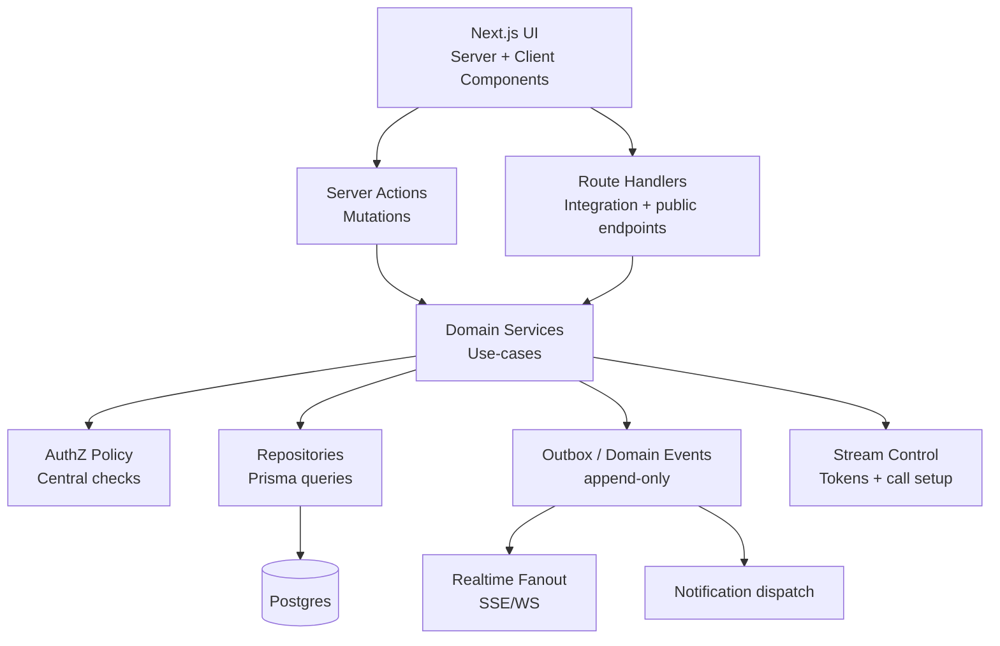
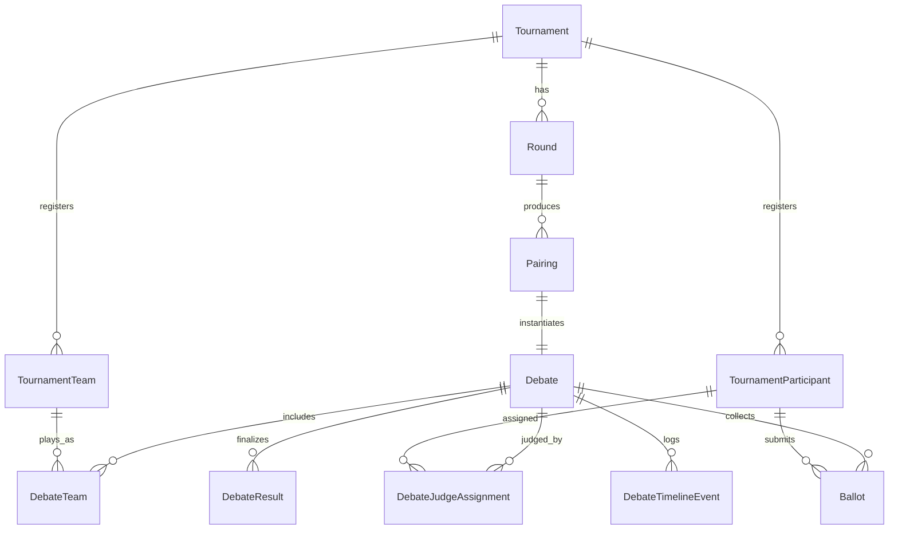
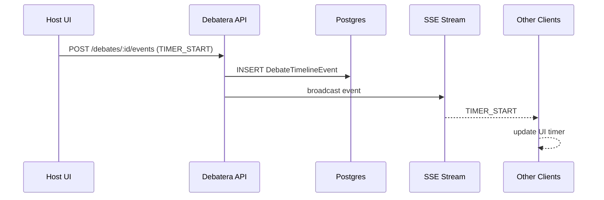

# Debatera Forward Architecture & Roadmap Plan

> **File:** [`docs/forward_plan.md`](docs/forward_plan.md:1)
>
> This document describes a long-term target architecture and phased roadmap for Debatera, based on the current repository state (Next.js App Router + Prisma/Postgres + Clerk + Stream) and the product intent described in [`docs/the_whole_idea.md`](docs/the_whole_idea.md:1).
>
> **Primary goal:** prioritize scalability, clean architecture, extensibility.

---

## 1) Executive summary

Debatera is converging on a unified platform to run debate competitions **online, IRL, or hybrid**, consolidating the “tool sprawl” (tabbing + comms + timers + feedback + room links) into one system.

The current codebase already provides:

- **Next.js App Router** with both UI pages and server-side HTTP endpoints ([`src/app/`](src/app/:1))
- **Auth via Clerk** and a local `User` table synced via [`ensureUserInDB()`](src/lib/ensureUser.ts:1)
- **Postgres + Prisma** with migrations and early domain models ([`prisma/schema.prisma`](prisma/schema.prisma:1))
- **Tournament registration + teams + settings** (institutions, participants, team DnD flow) + invitations + notifications

The biggest missing pieces for the product vision are:

- **Competition operations domain**: rounds, pairings/tabbing, debate rooms, adjudication, ballots, results, standings
- **Realtime control plane**: shared timer, speaking-order / POI events, room state
- **Operational maturity**: centralized authorization, observability, CI quality gates, migration safety

This plan proposes a **modular monolith** architecture with strong boundaries (“bounded contexts”) and a phased roadmap that lets you ship value continuously while building the foundation for a long-lived platform.

---

## 2) Current-state assessment (as-is)

### 2.1 Repository structure and runtime model

- **Monorepo-style single Next.js app**
  - UI routes under [`src/app/(main)/`](src/app/(main)/:1) and [`src/app/(auth)/`](src/app/(auth)/:1)
  - API route handlers under [`src/app/api/`](src/app/api/:1)
  - Server actions for some mutations under [`src/actions/`](src/actions/:1)

- **Data access**
  - Prisma singleton in [`src/lib/prisma.ts`](src/lib/prisma.ts:1)

- **Auth**
  - Clerk provider configured in [`src/app/layout.tsx`](src/app/layout.tsx:1)
  - Local DB user sync via [`ensureUserInDB()`](src/lib/ensureUser.ts:1)
  - Webhook endpoint exists under [`src/app/api/webhooks/clerk/route.ts`](src/app/api/webhooks/clerk/route.ts:1)

- **Mixed data access patterns** currently coexist:
  1) server components calling Prisma directly (e.g. tournament list)
  2) client components calling REST endpoints under `/api`
  3) client components calling server actions

This is normal in an MVP, but **needs consolidation** for long-term maintainability and consistent authorization/caching.

### 2.2 Domain capabilities present today

From [`prisma/schema.prisma`](prisma/schema.prisma:1) + docs:

- Institutions + membership with roles (`ADMIN`, `MEMBER`)
- Tournament creation + settings (registration window + team size constraints)
  - Note: some legacy fields remain on `Tournament` in addition to `TournamentSettings`
- Tournament registration
  - `TournamentInstitution` approval status (`PENDING/APPROVED/REJECTED`)
  - `TournamentParticipant` role (`DEBATER/JUDGE`)
- Team management
  - `TournamentTeam` + `TournamentTeamMember` (one participant → one team membership)
- Invitations + Notifications

### 2.3 Gaps vs product vision

From [`docs/the_whole_idea.md`](docs/the_whole_idea.md:1):

- No schema or services for **rounds, pairings, debates, rooms, judges panels, ballots, results, standings**
- Realtime domain (timer, POIs, speaking order) not modeled
- No clear “tournament lifecycle state machine” (draft → registration → rounds → completed)
- Authorization is implemented ad hoc in handlers/actions, not as a central policy layer

---

## 3) Architectural principles (target state)

1. **Bounded contexts, not just folders**
   - Each domain owns its invariants, policy checks, data access, and public service API.

2. **One place for rules**
   - UI and transport layers (route handlers/server actions) must be thin adapters.

3. **Policy-first authorization**
   - Centralize authorization decisions as composable policy helpers.

4. **Event-first thinking (within the monolith)**
   - Use an outbox/event log for auditing, realtime projections, and eventual integration.

5. **Explicit lifecycle states**
   - Registration open/closed, round published/locked, debate live/finished, ballot submitted/locked.

6. **Hybrid-ready**
   - Video is optional: the “control plane” must work for both online and IRL.

7. **Operational excellence is a feature**
   - Logs, metrics, error reporting, migration safety, and test coverage are non-negotiable for trust.

---

## 4) Target architecture: bounded contexts & internal modules

### 4.1 Proposed bounded contexts

- **Identity & Access**: Clerk integration, user sync, platform roles
- **Institutions**: institutions, memberships, invitations
- **Tournaments**: tournament entity, settings, lifecycle
- **Registration**: institution approval + participant registration
- **Teams**: teams and roster rules
- **Rounds & Pairing (Tabbing)**: rounds, pairing generation, constraints, publishing
- **Debates (Rooms)**: debate instances, room state, stream call linkage
- **Judging**: panels, ballots, rubrics, locking results
- **Notifications**: in-app notifications, delivery extension points
- **Realtime**: SSE/WS, event fanout, debounce/idempotency
- **Reporting**: standings, exports, analytics

### 4.2 Recommended code layout (modular monolith)

Introduce domain modules under `src/lib/domains/*`:

- [`src/lib/domains/identity/`](src/lib/domains/identity/:1)
- [`src/lib/domains/institutions/`](src/lib/domains/institutions/:1)
- [`src/lib/domains/tournaments/`](src/lib/domains/tournaments/:1)
- [`src/lib/domains/registration/`](src/lib/domains/registration/:1)
- [`src/lib/domains/teams/`](src/lib/domains/teams/:1)
- [`src/lib/domains/rounds/`](src/lib/domains/rounds/:1)
- [`src/lib/domains/pairing/`](src/lib/domains/pairing/:1)
- [`src/lib/domains/debates/`](src/lib/domains/debates/:1)
- [`src/lib/domains/judging/`](src/lib/domains/judging/:1)
- [`src/lib/domains/notifications/`](src/lib/domains/notifications/:1)
- [`src/lib/domains/realtime/`](src/lib/domains/realtime/:1)
- [`src/lib/domains/reporting/`](src/lib/domains/reporting/:1)

Each domain should include (minimum set):

- `types.ts` (domain-level types)
- `policy.ts` (authorization rules)
- `service.ts` (use-cases / orchestration)
- `repo.ts` or `queries.ts` (Prisma access)
- `validation.ts` (zod schemas for inputs)
- `events.ts` (domain event definitions)

### 4.3 Layering and dependency rules

**Rule:** dependencies only go inward:

- `src/app/*` (UI + route handlers) → domain services
- domain services → policy + repos
- repos → Prisma

UI components and route handlers should not call Prisma directly.

Add “boundary linting” later (ESLint rule / custom import restriction), but start with conventions.

### 4.4 Component diagram

---

## 5) Database roadmap (models + evolution)

### 5.1 Baseline schema today

Core models already exist:

- `User`
- `Institution`, `InstitutionMember`
- `Tournament`, `TournamentSettings`
- `TournamentInstitution`, `TournamentParticipant`
- `TournamentTeam`, `TournamentTeamMember`
- `InstitutionInvitation`, `Notification`

(See [`prisma/schema.prisma`](prisma/schema.prisma:1))

### 5.2 Target competition backbone (minimal set)

The recommended next-generation tournament operations schema is format-aware, audit-friendly, and extensible.

#### 5.2.1 Tournament lifecycle models

- `TournamentPhase` enum
  - `DRAFT`, `REGISTRATION`, `PAIRING_PREP`, `ROUNDS_RUNNING`, `COMPLETED`, `ARCHIVED`

- `TournamentRoleAssignment`
  - allows roles beyond “creator” (tab director, CA, etc.)

#### 5.2.2 Rounds + pairings + debates

- `Round`
  - `tournamentId`, `number`, `name?`, `format`, `status`
  - `motion?`, `infoSlide?`, `startsAt?`, `publishedAt?`, `lockedAt?`

- `Pairing`
  - `roundId`, `roomLabel`, `status`
  - unique per `(roundId, roomLabel)`

- `Debate`
  - `pairingId` 1:1
  - `isOnline` boolean
  - `streamCallId?`
  - `state`: `CREATED`, `OPEN`, `IN_PROGRESS`, `FINISHED`, `CANCELLED`

#### 5.2.3 Mapping teams/participants to debates

- `DebateTeam`
  - `debateId`, `teamId`, `side` and optional `position`

- `DebateSpeaker`
  - `debateId`, `participantId`, `teamId`, `speakingOrder`, `role`

#### 5.2.4 Judging

- `DebateJudgeAssignment`
  - `debateId`, `judgeParticipantId`, `panelRole` (`CHAIR`, `PANEL`, `TRAINEE`)

- `Ballot`
  - `debateId`, `judgeParticipantId`, `status`, timestamps

- `BallotScore` / `BallotComment`
  - rubric-based scoring + comments

- `DebateResult`
  - canonical aggregated outcome once locked

#### 5.2.5 Realtime control plane

- `DebateTimelineEvent`
  - append-only event log for timer, POIs, speaker changes
  - `payload` as JSONB

### 5.3 Target ER diagram

### 5.4 Migration strategy (safe evolution)

1. **Add new tables without breaking old flows**.
2. **Backfill incrementally**:
   - create `Round` rows for existing tournaments only when needed
   - create `Debate` only when a pairing is published
3. Keep legacy columns (like deprecated team-size fields) until production is stable, then remove.
4. Use **idempotent backfill scripts** and run them in staging first.

### 5.5 Data integrity and deletion policy

Current schema uses many `onDelete: Cascade`. That’s convenient early, but risky once tournaments contain historical results.

Long-term policy:

- After a tournament enters `ROUNDS_RUNNING`, disallow destructive deletes.
- Prefer **soft deletes** (archived flags) for critical entities (tournaments, debates, ballots).
- Make “audit trails” first-class: store `createdBy`, `updatedBy`, and outbox events.

---

## 6) API strategy (server actions vs REST)

### 6.1 Guiding rule

- Use **server actions** for first-party UI mutations (fast, typed, co-located with React flow).
- Keep **route handlers** for:
  - webhooks (Clerk)
  - vendor callbacks (Stream)
  - future public API / integrations

### 6.2 Consolidation: pick one dominant internal pattern

To reduce fragmentation, target:

- Reads: server components calling domain services (not Prisma)
- Writes: server actions calling domain services
- `/api/*`: only for integrations and a small set of stable client fetches (if needed)

This removes the current “three patterns per feature” effect.

### 6.3 Error handling and DTOs

Define domain-level error codes, e.g.:

- `AUTH_REQUIRED`
- `FORBIDDEN`
- `NOT_FOUND`
- `REGISTRATION_CLOSED`
- `INVALID_TEAM_SIZE`
- `BALLOT_LOCKED`

Return them consistently from both server actions and route handlers.

---

## 7) Authorization model (AuthZ)

### 7.1 Role layers

- **Authentication**: Clerk identity
- **Platform role**: admin / moderator (likely stored in Clerk metadata)
- **Institution role**: `InstitutionRole.ADMIN` / `MEMBER`
- **Tournament roles** (to introduce): organizer, tab director, CA, etc.
- **Debate roles**: speaker, judge, spectator (scoped to a debate)

### 7.2 Central policy functions

Create pure policy helpers for each domain, e.g.:

- [`canManageInstitution()`](src/lib/domains/institutions/policy.ts:1)
- [`canApproveTournamentInstitution()`](src/lib/domains/registration/policy.ts:1)
- [`canManageTournamentSettings()`](src/lib/domains/tournaments/policy.ts:1)
- [`canGenerateRoundPairings()`](src/lib/domains/pairing/policy.ts:1)
- [`canSubmitBallot()`](src/lib/domains/judging/policy.ts:1)

Route handlers and actions should call policy helpers and not re-implement rules.

### 7.3 Auditing

For sensitive actions, write domain events:

- tournament verified / rejected
- institution approved / rejected
- registration window changed
- pairings generated and published
- ballots submitted / locked

---

## 8) Realtime + video integration (Stream + control plane)

### 8.1 Separation of concerns

- **Stream** is the media plane (video/audio)
- **Debatera** is the control plane:
  - call creation + token issuance
  - debate room state (timer, speaking order, POI)
  - adjudication workflows

Persist `streamCallId` on `Debate`.

### 8.2 Realtime transport

Start with **SSE**:

- simpler operationally
- fits “broadcast state updates” (timer ticks can be computed locally; server sends events)

Move to **WebSocket** only if you need:

- bidirectional high-frequency state
- presence/typing indicators
- very low latency interactions

### 8.3 Event-sourced room state (lightweight)

Use `DebateTimelineEvent` as append-only truth.

Clients reconstruct state from:

- initial snapshot
- ordered events

This makes debugging and auditability far easier.

### 8.4 Realtime sequence diagram

---

## 9) Observability and production readiness

### 9.1 Logging

- Structured JSON logs
- Include correlation IDs:
  - `requestId`, `userId`, `tournamentId`, `debateId`

### 9.2 Metrics

Track:

- request latency percentiles per route
- DB query duration distribution
- SSE connections and churn
- Stream call join failure rates
- ballot submission success rate

### 9.3 Tracing

OpenTelemetry instrumentation for:

- Next route handlers
- Prisma
- outbound HTTP (Clerk, Stream)

### 9.4 Error reporting

Add Sentry (or similar) for both server and client.

---

## 10) Deployment architecture

### 10.1 Near-term

- Single Next.js deployment
- Managed Postgres (Neon/Supabase/RDS)
- Clerk + Stream configured per environment

### 10.2 Scale path

- Introduce a background worker for:
  - standings rebuild
  - scheduled notifications
  - export jobs
- Potentially separate realtime service if WS requirements exceed the Next runtime.

### 10.3 Environments

- local dev
- staging (webhooks + production-like data constraints)
- production

---

## 11) CI/CD plan

### 11.1 CI quality gates

On pull request:

- `npm ci`
- `npm run lint`
- `npm run build`
- `npx prisma validate`
- unit + integration tests

On main merge:

- run migrations on staging
- deploy

### 11.2 Migration checklist (required in PRs)

- Are there new indices for query patterns?
- Is there a backfill step?
- Any lock/scan risks?
- Is it safe for zero downtime?

---

## 12) Code conventions and guidelines

### 12.1 Service-first domain rules

- Domain service functions are the only place to mutate domain state.
- Transport layers (server actions / route handlers) must remain thin.

### 12.2 Validation

- Zod schemas in domain modules
- Reuse for both server actions and route handlers

### 12.3 Versioning

If/when you expose public endpoints:

- use `/api/v1/*`
- never break existing contracts without a version bump

---

## 13) Testing strategy

### 13.1 Testing pyramid

- Unit tests: policy checks, pairing algorithms, scoring aggregation
- Integration tests: Prisma + domain services against a test DB
- E2E tests: core flows (registration → teams → rounds → debate → ballot)

### 13.2 Critical invariants to test

- registration open/close enforcement
- institution admin permissions for team management
- pairing constraints (avoid same institution matchup when possible)
- ballot locking and immutability after lock
- event ordering and idempotency for realtime room state

---

## 14) Phased roadmap (12+ months)

> Adjust timelines based on resources. The ordering is more important than the exact dates.

### Phase 0 (Now → 1 month): Foundation hardening

- Consolidate authZ into policy modules
- Consolidate data access into domain services
- Decide primary internal transport pattern (server actions + RSC recommended)
- Fix “admin role propagation” and remove fragile client-derived auth flags

### Phase 1 (1–3 months): Rounds + pairing backbone

- Add `Round`, `Pairing`, `Debate` models
- Implement basic pairing generator (random + constraints) as a service
- UI for round creation, pairing preview, publish/unpublish, lock
- Add audit outbox events for pairing publication

### Phase 2 (3–6 months): Debate rooms + realtime control plane

- Debate room page
- Stream call creation/join and token issuance
- `DebateTimelineEvent` + SSE transport
- Timer + speaking order + POI event logging

### Phase 3 (6–9 months): Judging MVP

- Judge assignment (chair/panel/trainee)
- Ballot forms + validation
- Result aggregation and organizer locking
- Basic feedback archive per participant/team

### Phase 4 (9–12 months): Standings, exports, reliability

- Standings computation, caching, and export (CSV)
- Background jobs for standings rebuild and notifications
- Observability (metrics + tracing) fully wired

### Phase 5 (12 months+): Advanced and differentiators

- POI modes and anti-abuse analytics
- IRL venue logistics: rooms, schedules, announcements
- League/Elo system
- AI sparring opponent (experimental)

---

## 15) Key risks and mitigations

| Risk | Impact | Mitigation |
|---|---|---|
| Mixing server actions + REST + direct Prisma access | Inconsistency, duplicated business rules | Make domain services the only source of truth; thin adapters |
| Authorization drift across endpoints | Security vulnerabilities | Central policy layer + tests + audit events |
| Realtime complexity | Instability | Start with SSE + event log; upgrade to WS later |
| Pairing algorithm correctness | Tournament integrity | Unit tests + simulation fixtures + auditability |
| Migration/schema churn | Production incidents | migration checklist + staging + idempotent backfills |
| Vendor lock-in (Stream, Clerk) | Strategic constraint | Wrap vendor operations behind domain interfaces; store minimal vendor identifiers |

---

## 16) Contribution guidelines

### 16.1 Workflow

- Feature branches
- Small PRs scoped to a bounded context
- Update docs when adding models/endpoints

### 16.2 Definition of done

- zod input validation
- policy checks called (no inline authZ)
- tests for new invariants
- migrations included when schema changes

### 16.3 Documentation expectations

- Add/maintain docs under [`docs/`](docs/:1) for:
  - new domain models
  - new endpoints
  - operational requirements

---

## Appendix A) Repo references

- Product vision: [`docs/the_whole_idea.md`](docs/the_whole_idea.md:1)
- Team feature design: [`docs/tournament-teams.md`](docs/tournament-teams.md:1)
- Tournament settings rules: [`docs/tournament-settings.md`](docs/tournament-settings.md:1)
- Current schema: [`prisma/schema.prisma`](prisma/schema.prisma:1)
- Auth user sync: [`ensureUserInDB()`](src/lib/ensureUser.ts:1)
- Root layout: [`src/app/layout.tsx`](src/app/layout.tsx:1)
