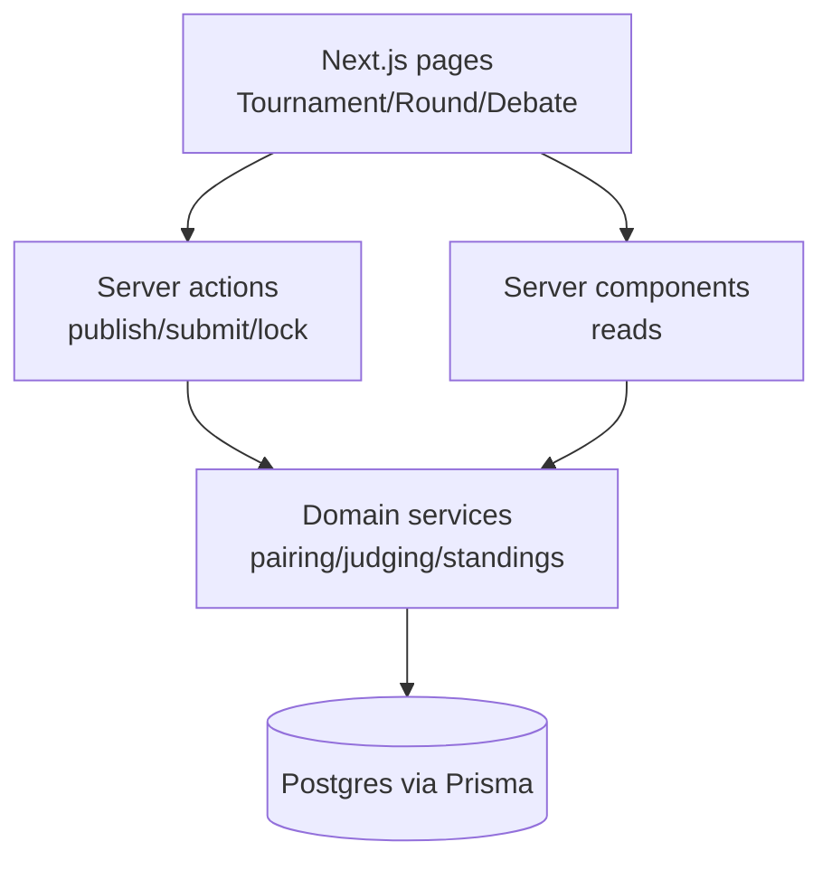
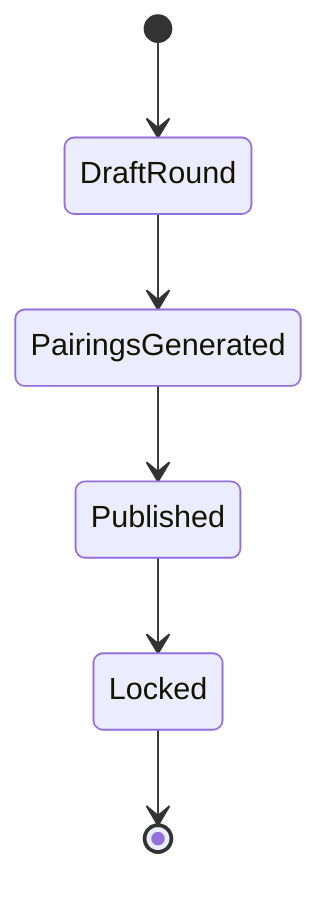

# Debatera MVP Plan (Weeks 1–16)

> **File:** [`docs/mvp_plan.md`](docs/mvp_plan.md:1)
>
> This document defines a **balanced MVP** (1–4 months) for Debatera, narrowed to: **pairings + basic debate room + basic ballot + standings** in intentionally thin, reliable forms.
>
> It complements the long-term plan in [`docs/forward_plan.md`](docs/forward_plan.md:1).

---

## 1) Executive summary

Debatera already has a working foundation: auth (Clerk), institutions/memberships, tournament creation, registration, teams, tournament settings, invitations and notifications.

The MVP goal is to complete the first end-to-end tournament loop:

1. Organizer prepares tournament (exists)
2. Teams register and are finalized (exists)
3. Organizer creates rounds and generates/publishes **pairings** (new)
4. Participants open a **basic debate room** (new)
5. Judges submit **basic ballots** (new)
6. System computes **standings** (new)

MVP emphasizes:

- correctness over sophistication (simple pairing algorithm, strict state transitions)
- minimal but scalable architecture decisions (domain services, consistent API pattern)
- auditable outcomes (results derived from ballots with lock states)

---

## 2) MVP scope (thin but complete)

### 2.1 In-scope (must ship)

#### A) Rounds + pairings (“tabbing-lite”)

- Create rounds per tournament (Round 1..N)
- Pair teams for a round (initially: **random pairing with constraints**)
- Publish pairings so participants can see their room assignment
- Lock a round after all ballots are in (or after admin action)

Constraints for MVP pairing generator:

- teams should not be paired against the same institution **when avoidable** (best-effort)
- no repeated matchup across completed rounds if avoidable (best-effort)
- if constraints cannot be satisfied, generator still produces pairings and flags violations

#### B) Basic debate room

A debate room is the “single place to go” once pairings are published.

Minimum features:

- room header: tournament, round, room label
- roster display: two teams + assigned judges
- motion display (if set for round)
- a simple timer UI (for MVP it can be **client-side only**, no realtime sync)
- optional placeholder for future Stream video (link/button, but not required)

#### C) Basic ballot

- judge submits winner + basic scoring fields
- optional free-text feedback
- ballot status lifecycle: `DRAFT` → `SUBMITTED` → (optional) `LOCKED`

MVP ballot model should allow:

- 1 ballot per judge per debate
- organizer can lock ballots or lock the debate result

#### D) Standings

- compute team standings from locked debate results
- standings page per tournament
- basic tie-breakers:
  - primary: wins
  - secondary: total points (if points exist)
  - tertiary: speaker points (optional; cuttable)

### 2.2 Nice-to-have (only if ahead)

- judge panel roles (chair/panel/trainee)
- SSE-based room state events (timer sync, speaker order)
- exports (CSV)

---

## 3) MVP success metrics

### 3.1 Product metrics

- **E2E completion rate**: ≥ 1 tournament can run at least 2 rounds end-to-end (pairings → debate room → ballots → standings)
- **Ballot submission success**: ≥ 95% ballot submissions succeed without manual DB intervention
- **Standings correctness**: 0 known incorrect standings for completed MVP tournaments (validated with fixtures and manual verification)
- **Time-to-pairings**: pairings generated and published in < 2 minutes for ≤ 64 teams

### 3.2 Engineering metrics

- `npm run build` passes on CI
- Prisma migrations validate (`prisma validate`)
- error rate on MVP endpoints < 1% in staging smoke tests
- key actions logged: pairings published, ballot submitted, result locked

---

## 4) Non-goals (explicitly out of MVP)

- advanced pairing algorithms (power-pairing, brackets, side constraints, judge allocations)
- IRL logistics (venues, schedules, announcements)
- POI modes and anti-abuse
- full Stream video integration (MVP may be “room shell” without video)
- public API versioning and third-party integrations
- Elo/league/rating system

---

## 5) Minimal architecture decisions (scalable path, minimal work)

### 5.1 Architectural shape: modular monolith (MVP edition)

Keep Next.js App Router as the single deployable. Introduce a consistent internal boundary:

- UI + route handlers + server actions are adapters
- domain services own business rules and Prisma access

This aligns with the direction described in [`docs/forward_plan.md`](docs/forward_plan.md:1).

### 5.2 API strategy for MVP

To reduce current fragmentation (server-Prisma reads + `/api` fetches + server actions), pick a dominant internal pattern:

- **Reads:** server components call domain query functions (no direct Prisma from UI)
- **Writes:** server actions for first-party UI mutations
- **Route handlers (`/api/*`):** webhooks + minimal stable endpoints only

### 5.3 State machines (minimal but strict)

Define lifecycle enums and enforce them in services:

- Round: `DRAFT`, `PUBLISHED`, `LOCKED`
- Debate: `CREATED`, `OPEN`, `FINISHED`, `LOCKED`
- Ballot: `DRAFT`, `SUBMITTED`, `LOCKED`

Rule: once locked, no destructive edits.

### 5.4 Standings computation strategy

MVP approach:

- compute standings on-demand (query + aggregate)
- optionally add a `StandingsSnapshot` later

Avoid background workers for MVP.

---

## 6) Minimal DB schema additions (Prisma)

> Baseline exists in [`prisma/schema.prisma`](prisma/schema.prisma:1).

### 6.1 Additions (minimal set)

#### A) Competition operations

- `Round`
  - `id`, `tournamentId`, `number`, `name?`, `status`, `motion?`, timestamps
  - unique `(tournamentId, number)`

- `Debate`
  - `id`, `roundId`, `roomLabel`, `status`, timestamps
  - unique `(roundId, roomLabel)`

- `DebateTeam`
  - `debateId`, `teamId`, `side` (e.g. `AFF`, `NEG`)
  - unique `(debateId, side)` and unique `(debateId, teamId)`

#### B) Judge assignment

- `DebateJudge`
  - `debateId`, `judgeParticipantId`, `role` (optional; default to `CHAIR`)
  - unique `(debateId, judgeParticipantId)`

#### C) Ballots + results

- `Ballot`
  - `debateId`, `judgeParticipantId`, `status`, `winnerSide`, `affPoints?`, `negPoints?`, `comments?`, timestamps
  - unique `(debateId, judgeParticipantId)`

- `DebateResult`
  - `debateId`, `status`, `winnerSide`, `lockedAt?`
  - 1:1 with Debate (unique `debateId`)

### 6.2 Indices (MVP performance)

- `Round(tournamentId)`
- `Debate(roundId)`
- `Ballot(debateId)`

### 6.3 Migration approach

- additive migrations only
- no backfills required until organizer creates first round

---

## 7) UX flows (MVP)

### 7.1 Roles (MVP)

- Organizer: tournament creator (and later tournament-role assignments)
- Participant: debaters on teams
- Judge: tournament participant with role `JUDGE`

### 7.2 Primary UX flows

#### Flow A: Organizer creates round and publishes pairings

1. Open tournament page ([`src/app/(main)/(home)/tournaments/[id]/page.tsx`](src/app/(main)/(home)/tournaments/[id]/page.tsx:1))
2. Navigate to “Rounds”
3. Create Round 1
4. Click “Generate Pairings”
5. Review pairing preview
6. Publish

#### Flow B: Participant finds their room

1. Tournament overview shows current round and room assignment
2. Click “Join room”
3. Debate room shows teams, judges, motion, timer

#### Flow C: Judge submits ballot

1. Judge opens debate room
2. “Ballot” tab
3. Winner + points + comments
4. Submit

#### Flow D: Organizer locks results and views standings

1. Organizer sees ballot completion
2. Lock result (or lock round)
3. Standings page updates

### 7.3 MVP pages

- Tournament
  - Overview
  - Registration (existing)
  - Teams (existing)
  - Rounds (new)
  - Standings (new)
- Round
  - Pairings list (new)
- Debate room
  - Room tab (new)
  - Ballot tab (new)

---

## 8) Minimal diagrams

### 8.1 Data flow overview

### 8.2 Pairings lifecycle

---

## 9) Week-by-week roadmap (Weeks 1–16)

> Each week ends with a demoable increment in staging.

### Week 1: MVP definition + scaffolding

- finalize MVP scope and naming conventions
- create domain module skeletons (rounds, pairing, debates, judging, standings)
- decide API pattern per feature (server actions vs route handlers)
- feature flags (optional) for hidden navigation items

Deliverable: MVP blueprint + skeleton routes/pages behind flags.

### Week 2: Round model + admin UI (create/list)

- add `Round` table and minimal CRUD
- organizer UI to create/list rounds
- tournament overview shows current round

Deliverable: organizer can create Round 1 and see it.

### Week 3: Debate model + pairings generator v1

- add `Debate`, `DebateTeam`
- pairing generator (random) with best-effort constraints:
  - avoid same institution
  - avoid repeat matchup
- pairing preview UI

Deliverable: preview pairings for a round.

### Week 4: Publish pairings + participant visibility

- publish pairings (status transition)
- participants can see their room assignment
- round page lists rooms with join links

Deliverable: published pairings visible to relevant users.

### Week 5: Debate room page v1

- implement debate room page
- show teams, judges placeholder, motion
- add simple timer (client-side only)

Deliverable: participants can open a room and see core info.

### Week 6: Judge assignment v1

- add `DebateJudge`
- organizer UI to assign judges (manual selection)
- debate room displays judge list

Deliverable: organizer assigns judges; room shows them.

### Week 7: Ballot model + ballot form v1

- add `Ballot` table
- judge can open ballot tab and save draft

Deliverable: ballot draft saved.

### Week 8: Ballot submit + locking rules

- submit ballot (validate required fields)
- prevent edits after submit (or allow edits until organizer lock)
- organizer view shows ballot completion

Deliverable: judge can submit; organizer can see completion.

### Week 9: DebateResult aggregation v1

- add `DebateResult`
- aggregate submitted ballots into a canonical result
- organizer can lock debate result

Deliverable: debate has an official winner.

### Week 10: Standings computation v1

- compute team standings from locked results
- standings page with sorting/ties

Deliverable: standings visible and correct for a sample tournament.

### Week 11: Round lock + navigation polish

- lock round when all debate results locked (or manual lock)
- tournament overview shows status and next action

Deliverable: clean tournament lifecycle across rounds.

### Week 12: Permissions + policy hardening

- centralize authorization checks:
  - who can generate/publish pairings
  - who can access debate room
  - who can submit ballot
  - who can lock result

Deliverable: permissions consistent and tested.

### Week 13: Testing depth + fixtures

- seed fixtures for:
  - 8 teams, 2 rounds
  - judges assigned
  - ballots submitted
- integration tests for:
  - pairing constraints
  - standings correctness

Deliverable: repeatable test tournament scenario.

### Week 14: UX refinement + error states

- loading and empty states
- clear call-to-actions
- UI validation error display

Deliverable: fewer dead ends.

### Week 15: Deployment readiness

- staging smoke tests
- migration rehearsal
- logging for key domain events

Deliverable: deployable MVP candidate.

### Week 16: MVP release + pilot tournament

- production deploy
- run a pilot tournament
- triage bugs and capture feedback

Deliverable: MVP shipped and validated in real conditions.

---

## 10) Testing plan (MVP)

### 10.1 Unit tests

- pairing generator:
  - no duplicate teams in same debate
  - constraint violation detection
- standings aggregation:
  - wins/points totals
  - deterministic tie-break ordering
- policy checks (authorization)

### 10.2 Integration tests

- create tournament → add teams → create round → generate/publish pairings
- assign judges → submit ballots → lock results → compute standings

### 10.3 E2E tests (optional but recommended)

- organizer: create round + publish
- judge: submit ballot
- participant: open room

### 10.4 Manual regression checklist

- round publish cannot happen twice
- ballot submit cannot happen without assignment
- standings exclude unfinished debates
- locked results cannot be changed

---

## 11) Deployment / ops checklist

- local dev `.env` aligns with [`.env.example`](.env.example:1)
- staging with separate Clerk + Postgres
- run migrations in staging first
- confirm indices exist and queries are performant enough
- backups configured (provider-managed)

---

## 12) Risks and mitigations

| Risk | Impact | Mitigation |
|---|---|---|
| Pairing disputes | Loss of trust | keep algorithm simple; show violations; add tests |
| AuthZ bugs | Security/data integrity | central policy checks + integration tests |
| Ballot schema churn | Rework | keep ballot minimal; avoid rubric complexity |
| Standings bugs | Core failure | deterministic aggregation + fixtures |
| Realtime/video overbuild | Schedule slip | timer local-only; video deferred |

---

## 13) What to cut first if behind schedule

Cut in this order:

1. realtime/shared timer sync (keep local)
2. judge panel roles (all judges same)
3. points/speaker points (wins-only standings)
4. pairing constraints beyond “valid pairing”
5. automated round locking
6. UI polish

Do not cut:

- publish pairings
- ballot submission
- standings
- lock semantics (immutability after lock)

---

## 14) MVP definition of done

MVP is complete when:

- a tournament can run 2 rounds end-to-end:
  - rounds created
  - pairings generated and published
  - debate rooms accessible
  - judges submit ballots
  - results lock
  - standings reflect outcomes
- success metrics in section 3 are met in a pilot tournament
